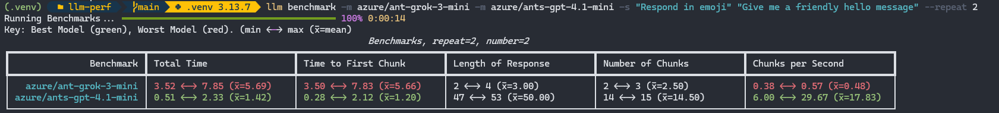

# LLM Benchmarking Plugin

This is a plugin for the [llm](https://llm.datasette.io) tool that adds a `benchmark` command to compare the performance of different language models.

The commands runs a prompt with optional system prompt for several models and compares the performance between models.

## Installation

You can install the plugin using pip:

```bash
pip install llm-profile
```

or using `llm`

```bash
llm install llm-profile
```

## Metrics

- Total time - The time taken from the request to the end of the final chunk
- Time to First Chunk - The time taken from the request to the first chunk of the response
- Length of Response - The length of the response text
- Number of Chunks - The number of chunks in the response
- Chunks per Second - The number of chunks divided by the total time taken

## Benchmark Usage

To run a benchmark, provide the prompt along with any number of models using the llm alias (from `llm models`):

```bash
$ llm benchmark -m azure/ant-grok-3-mini -m azure/ants-gpt-4.1-mini -s "Respond in emoji" "Give me a friendly hello message" --markdown
```

For a single pass (no repeats) you will get a summary table:


|               Benchmark | Total Time                | Time to First Chunk       | Length of Response        | Number of Chunks          | Chunks per Second         |
|-------------------------|---------------------------|---------------------------|---------------------------|---------------------------|---------------------------|
|   azure/ant-grok-3-mini | 7.79                      | 7.76                      | 112                       | 30                        | 3.85                      |
| azure/ants-gpt-4.1-mini | 2.99                      | 2.80                      | 78                        | 19                        | 6.36                      |

To repeat each benchmark and get an average of times, use the `--repeat` argument:

|               Benchmark | Total Time                | Time to First Chunk       | Length of Response        | Number of Chunks          | Chunks per Second         |
|-------------------------|---------------------------|---------------------------|---------------------------|---------------------------|---------------------------|
|   azure/ant-grok-3-mini | 2.59 <-> 8.39 (x̄=5.49)    | 2.57 <-> 8.36 (x̄=5.47)    | 65 <-> 109 (x̄=87.00)      | 18 <-> 30 (x̄=24.00)       | 2.15 <-> 11.58 (x̄=6.86)   |
| azure/ants-gpt-4.1-mini | 0.54 <-> 2.88 (x̄=1.71)    | 0.26 <-> 2.69 (x̄=1.47)    | 76 <-> 78 (x̄=77.00)       | 19 <-> 19 (x̄=19.00)       | 6.60 <-> 35.17 (x̄=20.89)  |

The printout is a range (min <-> max (x̄=mean))

### Providing options

You can provide key/value options for all models using the `--option` flag. This can be useful for setting parameters like temperature, max tokens, etc.

Example:

```bash
$ llm benchmark -m gpt-4.1-mini -m gpt-4.1-nano --option temperature 0.7 --option max_tokens 100 "Give me a friendly hello message"
```

This feature is also helpful for setting the `seed` option for reproducibility and isolating variances in time to first chunk and time to completion with the same prompt and result.

### Markdown formatted results

By default, tables are printed with color showing the fastest and slowest metric in a benchmark:



If you want to customize the output, you can use the `--markdown` flag to get the results in a Markdown-friendly format.

### Non-Streaming models

If you want to benchmark models that do not support streaming, you can use the `--no-stream` flag. This will disable streaming and provide a single response time.

