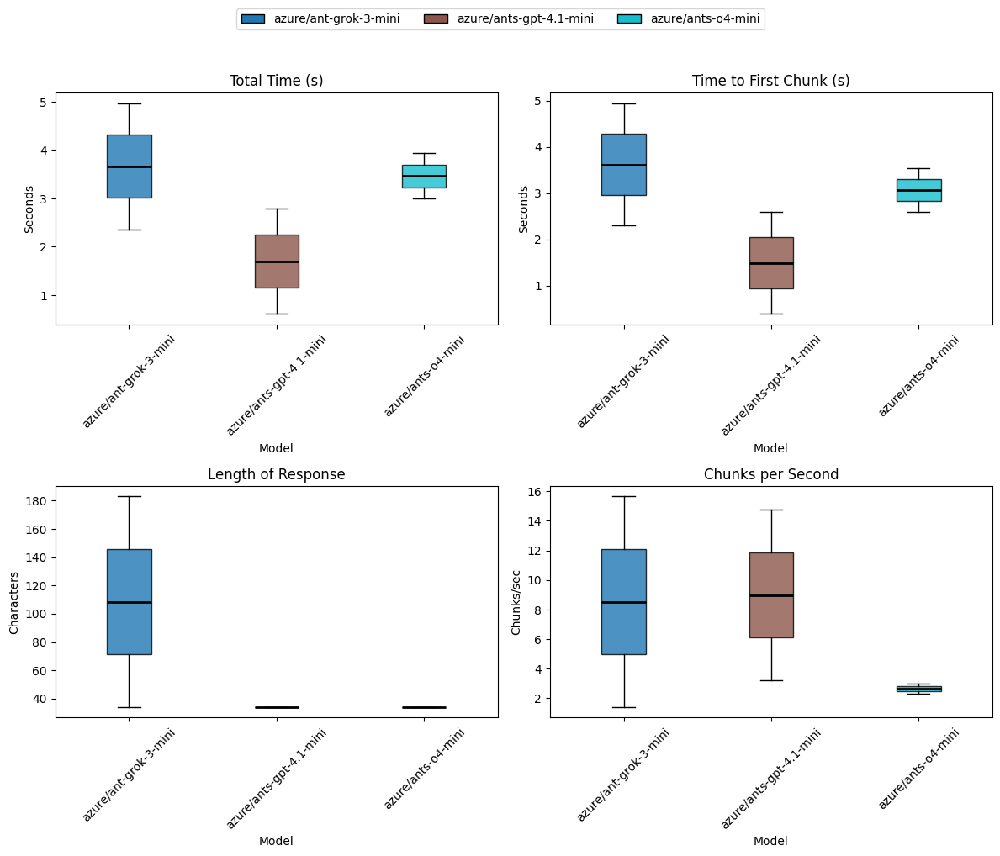

# LLM Benchmarking Plugin

This is a plugin for the [llm](https://llm.datasette.io) tool that adds a `benchmark` command to compare the performance of different language models.

The commands runs a prompt with optional system prompt for several models and compares the performance between models.

## Installation

You can install the plugin using pip:

```bash
pip install llm-profile
```

or using `llm`

```bash
llm install llm-profile
```

## Metrics

- Total time - The time taken from the request to the end of the final chunk
- Time to First Chunk - The time taken from the request to the first chunk of the response
- Length of Response - The length of the response text
- Number of Chunks - The number of chunks in the response
- Chunks per Second - The number of chunks divided by the total time taken

## Benchmark Usage

To run a benchmark, provide the prompt along with any number of models using the llm alias (from `llm models`):

```bash
$ llm benchmark -m azure/ant-grok-3-mini -m azure/ants-gpt-4.1-mini -s "Respond in emoji" "Give me a friendly hello message" --markdown
```

For a single pass (no repeats) you will get a summary table:


|               Benchmark | Total Time                | Time to First Chunk       | Length of Response        | Number of Chunks          | Chunks per Second         |
|-------------------------|---------------------------|---------------------------|---------------------------|---------------------------|---------------------------|
|   azure/ant-grok-3-mini | 7.79                      | 7.76                      | 112                       | 30                        | 3.85                      |
| azure/ants-gpt-4.1-mini | 2.99                      | 2.80                      | 78                        | 19                        | 6.36                      |

To repeat each benchmark and get an average of times, use the `--repeat` argument:

|               Benchmark | Total Time                | Time to First Chunk       | Length of Response        | Number of Chunks          | Chunks per Second         |
|-------------------------|---------------------------|---------------------------|---------------------------|---------------------------|---------------------------|
|   azure/ant-grok-3-mini | 2.59 <-> 8.39 (x̄=5.49)    | 2.57 <-> 8.36 (x̄=5.47)    | 65 <-> 109 (x̄=87.00)      | 18 <-> 30 (x̄=24.00)       | 2.15 <-> 11.58 (x̄=6.86)   |
| azure/ants-gpt-4.1-mini | 0.54 <-> 2.88 (x̄=1.71)    | 0.26 <-> 2.69 (x̄=1.47)    | 76 <-> 78 (x̄=77.00)       | 19 <-> 19 (x̄=19.00)       | 6.60 <-> 35.17 (x̄=20.89)  |

The printout is a range (min <-> max (x̄=mean))

### Providing options

You can provide key/value options for all models using the `--option` flag. This can be useful for setting parameters like temperature, max tokens, etc.

Example:

```bash
$ llm benchmark -m gpt-4.1-mini -m gpt-4.1-nano --option temperature 0.7 --option max_tokens 100 "Give me a friendly hello message"
```

This feature is also helpful for setting the `seed` option for reproducibility and isolating variances in time to first chunk and time to completion with the same prompt and result.

### Markdown formatted results

By default, tables are printed with color showing the fastest and slowest metric in a benchmark:


If you want to customize the output, you can use the `--markdown` flag to get the results in a Markdown-friendly format.

### Non-Streaming models

If you want to benchmark models that do not support streaming, you can use the `--no-stream` flag. This will disable streaming and provide a single response time.

### Warmup

By default, the first test will be repeated and only the second timing data will be used. This is to allow the model to setup authentication or anything else which will skew the performance metrics.

You can disable this behavior by using the `--no-repeat-first` flag.

### Graphs

The benchmark tool can produce a PNG graph like this:



To get a graph, add the `--graph file.png` with the path to the results graph file. You will need to install `matplotlib` to generate the graph:

```bash
$ pip install llm-profile[graph]
```

matplotlib isn't installed by default to keep the dependencies for this plugin smaller.

### Saving results

You can save the benchmark results, including the text from each prompt to a YAML file using the `--output` option:

```bash
$ llm benchmark --output results.yaml
```

All of the timing data for each request as well as the text response will be saved in the YAML file:

```yaml
GPT-5-chat (Azerbaijan):
- chunks_per_sec: 19.549590468140675
  length_of_response: 34
  model_name: GPT-5-chat (Azerbaijan)
  n_chunks: 9
  text: The capital of Azerbaijan is Baku.
  time_to_first_chunk: 0.36127520000445656
  total_time: 0.46036770001228433
- chunks_per_sec: 20.64352283058553
  length_of_response: 34
  model_name: GPT-5-chat (Azerbaijan)
  n_chunks: 9
  text: The capital of Azerbaijan is Baku.
  time_to_first_chunk: 0.3545127999968827
  total_time: 0.43597210000734776
```

### Test Plans

Instead of providing tests and scenarios on the command line you can provide a YAML file with the benchmark plan:

```bash
$ llm benchmark --plan plan.yaml
```

To get a printout of exactly what will be tested, use the `--verbose` option.

A single-plan YAML file (one plan mapping):

```yaml
name: Capital Cities  # required
repeat: 3 # optional, defaults to 1
system: "You are a helpful assistant." # optional
prompt: "Answer concisely." # optional, defaults to model.prompt
options: # optional, must be options which apply to all models
  max_output_tokens: 50

models:
  - name: GPT-5-mini (Azerbaijan) # required, used for graphs and tables
    model: azure/gpt-5-mini # required, llm ID from `llm models
    prompt: "What is the capital of Azerbaijan?" # Optional, defaults to plan prompt

  # Example of second model test in plan
  - name: GPT-5-mini (France, short) 
    model: azure/gpt-5-mini
    prompt: "What is the capital of France?"
    options:
      max_output_tokens: 10 # overrides plan options by key
```

Field reference

- `name` (string, required) — Plan label used in output.
- `models` (list of mappings, required) — Each entry is a `TestModel` with the fields below.
- `repeat` (int, optional) — Number of times to repeat the plan (default: 1).
- `system` (string, optional) — Global system prompt for all models unless `model.system` is set.
- `prompt` (string, optional) — Global prompt for all models unless `model.prompt` is set.
- `options` (mapping, optional) — Plan-level option defaults (merged with each model’s `options`).

`model` entries (per item in `models`):

- `name` (string, required) — Label shown in tables/plots.
- `model` (string, required) — Model identifier passed to `llm.get_model(...)`.
- `system` (string, optional) — Model-specific system prompt (overrides plan-level `system`).
- `prompt` (string, optional) — Model-specific prompt (overrides plan-level `prompt`).
- `options` (mapping, optional) — Model-specific options (override plan-level `options`).

Behavior notes

- Per-model `options` override plan-level `options`. The code merges plan options then model options before prompting.
- If a model doesn’t set `prompt`/`system`, the plan-level `prompt`/`system` are used.
- Option keys and types are validated at runtime against the model’s `Options` schema (see `build_options` / `model.Options`).

#### Example 1: Comparing prompts

This test will test the same model with different prompts:

```yaml
name: Prompt Comparison
models:
  - name: Capital of Azerbaijan
    model: azure/gpt-5-chat
    prompt: "What is the capital of Azerbaijan?"
  - name: Capital of France
    model: azure/gpt-5-chat
    prompt: "What is the capital of France?"
repeat: 5
```

#### Example 2: Several Models, one with overrides on options

```yaml
name: Capital Cities
models:
  - name: GPT-5-chat (Azerbaijan)
    model: azure/gpt-5-chat
    prompt: "What is the capital of Azerbaijan?"
  - name: GPT-5-chat (France)
    model: azure/gpt-5-chat
    prompt: "What is the capital of France?"
  - name: GPT-5-chat (one word)
    model: azure/gpt-5-chat
    system: "Only respond with 1 word answers"
    prompt: "What is the capital of France?"
  - name: GPT-5-chat (low temp)
    model: azure/gpt-5-chat
    prompt: "What is the capital of France?"
    options:
      temperature: 0.5
system: "You are a helpful little robot"
repeat: 3
options:
  temperature: 0.9
```

## Embedding Benchmarks

As well as language models, you can benchmark embedding models using a similar approach. The main difference is in the input data and the model selection.

To see available embedding models, use the `llm embed-models` command.

Give this list to the `llm embed-benchmark` command like so:

```bash
$ llm embed-benchmark "I'm on the red eye flight to nowhere. How about you?" -m  azure/text-embedding-3-small-512 -m  azure/text-embedding-3-small -m azure/text-embedding-ada-002 -m nomic-embed-text:latest --repeat 2 --markdown --graph embed-graph.png
```

This provides a comparison table:

|                        Benchmark | Total Time                |
|----------------------------------|---------------------------|
| azure/text-embedding-3-small-512 | 0.26 <-> 0.93 (x̄=0.59)    |
|     azure/text-embedding-3-small | 0.91 <-> 3.45 (x̄=2.18)    |
|     azure/text-embedding-ada-002 | 0.92 <-> 3.49 (x̄=2.20)    |
|          nomic-embed-text:latest | 1.03 <-> 1.15 (x̄=1.09)    |

As well as a graph:


### Embedding Model Plans

You can provide a YAML file with the benchmark configuration for embedding models in a similar way to language models:

```yaml
name: Embedding Benchmark
data: "The input to the embedding model"
models:
  - name: Azure Text Embedding 3 Small 512
    model: azure/text-embedding-3-small-512
  - name: Azure Text Embedding 3 Small
    model: azure/text-embedding-3-small
  - name: Azure Text Embedding ADA 002
    model: azure/text-embedding-ada-002
  - name: Nomic Embed Text Latest
    model: nomic-embed-text:latest
repeat: 2
```